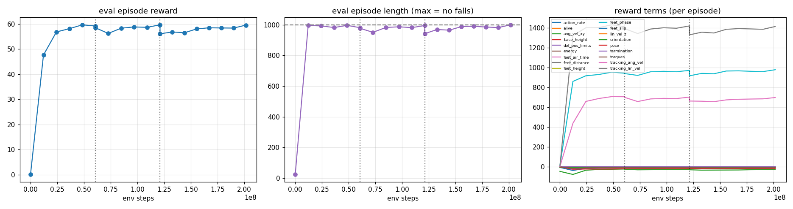

# GO-BDX Walking: GPU Reinforcement Learning with MuJoCo MJX

<p align="center">
  
</p>

<p align="center">
  <i>The trained policy following velocity commands: stand, forward, turn, backward, sidestep, then a 40 N side push.<br>
  Green arrow = commanded direction · red arrow = push · overlay = command vs. measured velocity.<br>
  Everything is physics: the policy only sets joint targets for torque-limited motors, 50 times a second.</i>
</p>

A velocity-commanded walking controller for the **GO-BDX** bipedal robot. It's
trained with PPO on thousands of simulated robots in parallel on one GPU
([MuJoCo MJX](https://mujoco.readthedocs.io/en/stable/mjx.html) +
[Brax](https://github.com/google/brax)). The trained policy runs on plain NumPy,
so the same controller code drives the simulator and the real robot.

| | |
|---|---|
| **Commands** | forward/back velocity, sideways velocity, turn rate (joystick style) |
| **Velocity tracking** | 0.30 m/s commanded, 0.300 m/s measured |
| **Push recovery** (0.2 s pushes, 8 directions) | 100% survived up to 50 N standing or walking (training max 55 N) |
| **Training time** | about 35 min for 200M steps on one V100, at about 160k env steps/s |
| **Robustness training** | random pushes, masses, friction, motor gains, 0–20 ms latency, encoder offsets, sensor noise |

---

## Contents
- [Quick start (no training needed)](#quick-start-no-training-needed)
- [Repository layout](#repository-layout)
- [Installation](#installation): your PC · a Linux GPU machine · an HPC cluster (ParamShakti)
- [Training](#training)
- [Watching and evaluating a policy](#watching-and-evaluating-a-policy)
- [How it works](#how-it-works)
- [Deploying on the real robot](#deploying-on-the-real-robot)
- [The robot model](#the-robot-model)
- [Troubleshooting](#troubleshooting)
- [Acknowledgements](#acknowledgements)

---

## Quick start (no training needed)

A trained policy ships in `pretrained/`. It only needs NumPy and MuJoCo:

```bash
pip install mujoco numpy pillow
python -m bdx_mjx.play pretrained/go_bdx_walk.npz            # interactive viewer, real time
```

Steer it with the arrow keys (full key list [below](#watching-and-evaluating-a-policy)).
Press **Insert** to push it.

---

## Repository layout

```
bot_learning/
├── bdx_mjx/                         # everything for training + running the walking policy
│   ├── assets/build_model.py        #   rebuilds the simulation model from the CAD export
│   ├── assets/xmls/                 #   go_bdx_train.xml (MJX, no meshes) / go_bdx_view.xml (+ meshes)
│   ├── joystick.py                  #   the RL task: observations, rewards, pushes, commands
│   ├── randomize.py                 #   per-robot domain randomization
│   ├── train.py                     #   PPO training with the push curriculum
│   ├── policy.py                    #   NumPy policy + WalkController (sim and real robot)
│   ├── play.py                      #   viewer, video recording, push-survival test
│   ├── demo_gif.py                  #   renders the GIF above
│   ├── constants.py                 #   joint/sensor names, paths
│   ├── mjx_env.py, wrapper.py       #   env base class + Brax wrappers (from MuJoCo Playground)
│   ├── requirements.txt             #   pip packages (any OS)
│   ├── requirements-lock-linux.txt  #   exact pinned set for Linux + CUDA 12 (used on the cluster)
│   └── slurm/                       #   HPC scripts (ParamShakti)
├── robot/                           # the robot as exported from CAD
│   ├── go_bdx.urdf, go_bdx.xml, meshes/
│   └── convert_urdf.py, simulate.py, keyboard_control.py
├── pretrained/                      # trained policy (go_bdx_walk.npz) + its push-test results
└── docs/media/                      # README images
```

Training writes to `runs/<name>/` (not tracked by git).

---

## Installation

The code needs **Python 3.11**. Pick the section that matches your machine.

| Machine | Can train? | Can watch/play? |
|---|---|---|
| Windows / macOS / Linux, no NVIDIA GPU | only tiny smoke tests (CPU) | yes |
| Linux + NVIDIA GPU (driver ≥ 525) | yes, fast | yes |
| HPC with old Linux (e.g. CentOS 7) | yes, through a container | headless only |

> JAX only uses the GPU on **Linux**. On Windows it runs on the CPU. To train on
> a Windows PC's NVIDIA GPU, use WSL2 (`wsl --install`) and follow the Linux
> instructions inside it.

### A. Your PC (any OS, CPU): watching, testing, small runs

```bash
conda create -n bdx python=3.11 -y
conda activate bdx
pip install -r bdx_mjx/requirements.txt
```

Check it:
```bash
python -m bdx_mjx.play pretrained/go_bdx_walk.npz --push-test
python -m bdx_mjx.train --preset cpu_test          # ~5 min end-to-end smoke test
```

### B. Linux workstation with an NVIDIA GPU

Same as A, plus the CUDA 12 build of JAX:
```bash
conda create -n bdx python=3.11 -y
conda activate bdx
pip install -r bdx_mjx/requirements.txt "jax[cuda12]==0.9.2"
python -c "import jax; print(jax.devices())"       # must list a CudaDevice
```

For the exact package set that was trained with, use
`pip install --no-deps -r bdx_mjx/requirements-lock-linux.txt` instead.

> **Don't upgrade JAX past 0.9.x.** Brax 0.12.5 calls
> `jax.device_put_replicated`, which JAX 0.10 removed.

### C. HPC cluster with an old OS (how this was trained on ParamShakti)

ParamShakti runs CentOS 7 (glibc 2.17), but every modern `jaxlib` needs glibc ≥ 2.28.
So JAX can't run on the host in any conda env. It runs in a small
**Apptainer container** (Debian, Python 3.11) instead, with the packages in a
venv on scratch and `--nv` passing the GPU through.

The scripts live in `bdx_mjx/slurm/`. Paths and the container module are set in
`env.sh`; edit `PROJECT`/`BDX_ENV` there for your own account.

| Script | Where it runs | What it does |
|---|---|---|
| `env.sh` | sourced by the others | paths; picks a working apptainer/singularity module |
| `fetch_env.sh` | login node (has internet) | pulls the container image, downloads the packages |
| `download_wheels_pc.py` | your PC | the same download, in parallel, if the cluster's network is slow |
| `install_env.slurm` | `shared` partition, CPU job | builds the venv offline from the downloaded files |
| `test_gpu.slurm` | `gpu` partition, ~10 min | checks the GPU, MJX speed, the full pipeline, push test |
| `train_gpu.slurm` | `gpu` partition | trains, then runs the push test |

**One-time setup**
```bash
cd /scratch/<you>/bot_learning
bash bdx_mjx/slurm/fetch_env.sh                  # login node: pull image + download packages
mkdir -p logs
sbatch bdx_mjx/slurm/install_env.slurm           # install offline (compute nodes have no internet)
sbatch bdx_mjx/slurm/test_gpu.slurm              # optional sanity check, ends with "ALL PASSED"
```

If the login node downloads slowly, download on your PC instead and copy the files over:
```bash
python bdx_mjx/slurm/download_wheels_pc.py       # -> wheels_linux/ (only downloads)
scp wheels_linux/* <you>@<login-node>:/scratch/<you>/bdx_env/wheels/
bash bdx_mjx/slurm/fetch_env.sh                  # on the cluster: pulls the image, skips the packages
```

**Cluster rules that shaped these scripts**
- **Nothing heavy on the login node.** Conda's classic solver ran for over 30 minutes there, and the job was killed with a warning. That's why the only login-node step is downloading.
- **No internet on compute nodes**, so installing happens offline from the downloaded files.
- **Sizing:** training needs 1 GPU, 8 CPUs and 32 GB RAM. Physics, policy and PPO all run on the GPU, so more CPUs don't help.

---

## Training

```bash
python -m bdx_mjx.train --preset gpu            # 8192 envs, 200M steps  (>= 8 GB VRAM)
python -m bdx_mjx.train --preset gpu_small      # 2048 envs, 150M steps  (4-6 GB VRAM)
python -m bdx_mjx.train --preset cpu            # 128 envs on CPU, learning sanity check
python -m bdx_mjx.train --preset cpu_test       # tiny, ~5 min, tests the pipeline
```

| Option | Meaning |
|---|---|
| `--num-timesteps N` | total environment steps (split over the curriculum phases) |
| `--num-envs N` | parallel robots; `batch_size × num_minibatches` (8192 for `gpu`) must be a multiple |
| `--resume runs/<run>/checkpoints/<file>.pkl` | continue from a checkpoint (weights + normalizer) |
| `--start-phase 3` | skip earlier curriculum phases (used with `--resume`) |
| `--run-name`, `--runs-dir`, `--seed` | where results go, randomness |
| `--impl warp` | use the MuJoCo Warp backend (Linux GPU, not tested) |

On the cluster, `train_gpu.slurm` takes the same settings when you submit it:
```bash
sbatch bdx_mjx/slurm/train_gpu.slurm                                   # full run
sbatch --export=ALL,RESUME_FROM=runs/<run>/checkpoints/phase3_hard_push.pkl,START_PHASE=3,TIMESTEPS=250000000 \
       bdx_mjx/slurm/train_gpu.slurm                                   # fine-tune phase 3 only
```

**Output** (`runs/<name>/`)

| File | Contents |
|---|---|
| `policy.npz` | the policy for `play.py` / the robot (NumPy only) |
| `checkpoints/` | Brax params: `latest.pkl`, one per eval, `phase<N>_<name>.pkl` at each phase end |
| `progress.csv`, `progress.png` | eval reward, episode length and every reward term vs. steps |
| `config.json` | full env + PPO configuration of the run |

**What healthy training looks like:**
- **Episode length** reaches 1000 (20 s with no falls) early in phase 1, and stays high as the pushes get harder.
- **`tracking_lin_vel` / `tracking_ang_vel`** rise and level off.

<p align="center"></p>

---

## Watching and evaluating a policy

`play.py` runs the policy in plain MuJoCo at **real time**: the NumPy policy plus
the same sensor-to-observation code as the real robot.

```bash
python -m bdx_mjx.play pretrained/go_bdx_walk.npz                  # viewer (or pass a run directory)
python -m bdx_mjx.play runs/<run> --cmd 0.3 0 0                     # start walking forward
python -m bdx_mjx.play runs/<run> --no-reset                        # it stays down if knocked over
python -m bdx_mjx.play runs/<run> --video walk.mp4 --seconds 10 --cmd 0.3 0 0
python -m bdx_mjx.play runs/<run> --push-test                       # survival table
python -m bdx_mjx.demo_gif runs/<run> --out docs/media/walk_demo.gif
```

| Key (viewer) | Action |
|---|---|
| ↑ / ↓ | forward / backward speed (±0.05 m/s per press) |
| ← / → | turn rate |
| PgUp / PgDn | sideways speed |
| Home | stop (stand still) |
| End | reset the robot |
| Insert | push the torso (`--push-force`, default 40 N) |
| double-click body, then Ctrl + right-drag | push it by hand (MuJoCo's own tool) |

Push test of the included policy (`pretrained/push_test.txt`):
```
push duration 0.2 s, 8 directions per cell. Training max: 55 N.
                       20 N     30 N     40 N     50 N     60 N     70 N
standing              100%     100%     100%     100%      75%      62%
walking 0.3 m/s       100%     100%     100%     100%      88%      75%
```

---

## How it works

**The task (`joystick.py`).** Every 20 ms (50 Hz) the policy gets a command
`(vx, vy, yaw rate)` and outputs 10 joint targets:
`target = standing_pose + 0.4 × action`. These go to torque-limited PD motors.
Physics runs at 250 Hz (5 MuJoCo steps per action).

| | |
|---|---|
| **Policy inputs** (43) | gyro, gravity direction (IMU), command, joint angles and velocities, last action, gait clock (sin/cos per leg) |
| **Critic inputs** (103, training only) | the above plus true velocity, contacts, foot velocities and heights, motor torques, push force |
| **Commands** | vx ∈ [-0.3, 0.5] m/s, vy ∈ [-0.2, 0.2] m/s, yaw ∈ [-0.8, 0.8] rad/s; zero 20% of the time; resampled every 10 s |
| **Network** | MLP 512-256-128 for the policy and the critic, PPO (Brax) |

The policy only gets what a real robot can measure. The critic gets privileged
simulator state to learn faster ("asymmetric actor-critic").

**Rewards**

| Term | Weight | Purpose |
|---|---|---|
| `tracking_lin_vel` | +1.5 | follow commanded vx, vy (`exp(-err²/0.1)`) |
| `tracking_ang_vel` | +0.8 | follow commanded turn rate |
| `feet_phase` | +1.0 | feet follow the gait clock's swing height (5 cm); both feet down when standing |
| `feet_air_time` | +2.0 | reward real steps (0.15–0.4 s of air time) while moving |
| `orientation` | −2.0 | stay upright |
| `stand_still` | −0.5 | hold the standing pose at zero command |
| `feet_distance` | −5.0 | keep the feet apart (there is no leg-leg collision) |
| `feet_slip`, `lin_vel_z`, `ang_vel_xy` | −0.5, −0.5, −0.15 | no sliding, bouncing or wobbling |
| `action_rate`, `torques`, `pose`, `dof_pos_limits` | −0.02, −1e-4, −0.5, −1.0 | smooth, efficient, near the natural pose, inside joint limits |

The walking and air-time rewards are what prevent the classic failure of
"stand still and collect reward".

**Push curriculum (`train.py`).** The reward stays the same throughout, because
swapping reward functions between stages breaks the value function. Only push
strength ramps up. A push is a horizontal force on the torso, in a random direction,
lasting 0.1–0.2 s, every 4–8 s:

| Phase | Share of steps | Push force | Why |
|---|---|---|---|
| 1 walk | 30% | 5–20 N | below what the stiff stance survives, so the gait is learned first |
| 2 push | 30% | 10–40 N | moderate pushes; some need a step |
| 3 hard_push | 40% | 10–55 N | beyond the passive limit (measured 30 N forward), so it must step to recover |

55 N for 0.2 s is about 0.95 m/s of velocity change. That needs one big or two
normal recovery steps (by the capture point), which is about the most this leg length can take.

**Domain randomization (`randomize.py` + `joystick.py`).** Each of the 8192 simulated
robots gets its own physics:

| Parameter | Range |
|---|---|
| floor friction | 0.4–1.0 |
| link masses | ±10% |
| torso payload | −0.5 to +1.0 kg |
| torso centre of mass | ±1.5 cm |
| motor kp | ±15% |
| motor kd | ±20% |
| joint friction / damping | ×0.5–2 |
| armature | ×1–1.5 |
| actuation latency | 0 or 20 ms |
| encoder offsets | ±0.03 rad |
| sensor noise | gyro 0.2 rad/s · gravity 0.05 · joint angle 0.03 rad · joint velocity 1.5 rad/s |

**Throughput.** All 8192 robots, the policy and the PPO update are one compiled
XLA program on the GPU: about 160k env steps/s (800k physics steps/s) on a V100.

---

## Deploying on the real robot

`bdx_mjx/policy.py` has no JAX dependency. `WalkController` builds exactly the
observation used in training. In testing it matched the training environment to
float precision: observations to within 1e-5, actions to within 3e-6.

```python
from bdx_mjx.policy import WalkController

ctrl = WalkController("pretrained/go_bdx_walk.npz")
ctrl.command[:] = [0.3, 0.0, 0.0]            # vx [m/s], vy [m/s], yaw rate [rad/s]

while True:                                  # every 20 ms (50 Hz)
    targets = ctrl.step(gyro,                # IMU angular velocity, IMU frame (x fwd, y left, z up)
                        gravity,             # unit gravity vector in the IMU frame, (0,0,-1) upright
                        joint_pos,           # 10 leg joints, order = constants.LEG_JOINTS
                        joint_vel)
    send_position_targets(targets)           # to the motors' PD controllers
```

Before trying hardware:
1. **Weigh the parts.** Put the real link masses in `MASSES` in `bdx_mjx/assets/build_model.py`, run it, and retrain. The masses in the model are estimates.
2. **Match the motor PD gains** (`kp`/`kv` in `build_model.py`) and joint zero offsets to the real motors.
3. **Check each joint's sign and axis** against `constants.LEG_JOINTS` (see below).

---

## The robot model

The CAD export (`robot/go_bdx.xml`) had placeholder physics:
- a 28 kg base, whose mass came from the mesh volume at water density
- 1e-4 inertias everywhere
- collision on the visual meshes
- unlimited torque

`bdx_mjx/assets/build_model.py` keeps its kinematics and visuals, and rebuilds the physics:

| | |
|---|---|
| mass | 11.6 kg total; each link's inertia computed from its mesh (**estimated masses**) |
| collision | a flat box under each foot, fitted to the sole mesh |
| motors | torque-limited PD (23.7 Nm, like the Unitree GO-M8010-6); gains high enough to stand at zero action |
| head | neck, head and antenna joints frozen |
| IMU | site with x forward, y left, z up; gyro, accelerometer, velocity and foot sensors |

**The CAD joint names don't match their axes.** The names are kept to match the
hardware; `constants.py` groups the joints by what they actually do:

| CAD name | Actual motion |
|---|---|
| `*_hip_roll` | hip **yaw** (vertical axis) |
| `*_hip_pitch` | hip **roll** (forward axis) |
| `*_hip_yaw` | hip **pitch** (lateral axis) |
| `*_shin` | knee |
| `*_foot` | ankle |

**CAD model tools** (`robot/`, run from anywhere):
```bash
python robot/convert_urdf.py       # regenerate robot/go_bdx.xml from the URDF
python robot/simulate.py           # passive viewer
python robot/keyboard_control.py   # move joints by hand: Tab = joint group, Q/A W/S E/D = joints, R = reset
```

---

## Troubleshooting

| Symptom | Cause / fix |
|---|---|
| `jax.devices()` shows only CPU | On Windows that's expected (use WSL2 or Linux). On Linux, install `jax[cuda12]` and check `nvidia-smi` (driver ≥ 525). |
| `AttributeError: jax.device_put_replicated is deprecated` | JAX ≥ 0.10 is installed; pin `jax==0.9.2 jaxlib==0.9.2`. |
| `jaxlib requires __glibc >=2.28` (conda) / no matching jaxlib (pip) | The OS is too old (e.g. CentOS 7); use the container route (Installation C). |
| `apptainer: libsubid.so.3: cannot open shared object file` | That apptainer module is broken; `env.sh` falls back to `apptainer/1.2.5` or `singularity`. |
| `Failed to import warp` | Harmless. MJX's optional Warp backend isn't installed and isn't used. |
| `batch_size * num_minibatches must be a multiple of num_envs` | Use 8192, 4096, 2048, … envs with the `gpu` preset. |
| Windows `pip install` fails with "filename too long" | Pin `orbax-checkpoint==0.11.28` (already in `requirements.txt`). |
| The robot sways or taps while standing | Train longer in phase 3, or raise `stand_still` in `joystick.default_config()`. |

---

## Acknowledgements

**Trained on [PARAM Shakti](https://paramshakti.iitkgp.ac.in/), the national
supercomputing facility at IIT Kharagpur** (NVIDIA Tesla V100 GPU nodes).

Built on [MuJoCo](https://github.com/google-deepmind/mujoco) /
[MJX](https://mujoco.readthedocs.io/en/stable/mjx.html),
[Brax](https://github.com/google/brax), [JAX](https://github.com/jax-ml/jax) and
[MuJoCo Playground](https://github.com/google-deepmind/mujoco_playground). The task
design follows Playground's locomotion environments, and `bdx_mjx/mjx_env.py` and
`bdx_mjx/wrapper.py` are adapted from it (Apache-2.0).

## License

MIT, except the files adapted from MuJoCo Playground (Apache-2.0, see their headers).
