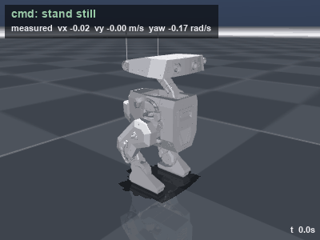

# GO-BDX Walking: Reinforcement Learning with MuJoCo MJX

A walking controller for the GO-BDX biped, trained with reinforcement learning
(PPO) on thousands of parallel simulations on one GPU. It follows forward, sideways
and turning commands, and recovers from pushes.

<p align="center">
  
</p>

## Quick start

A trained policy is included, so nothing needs training first:

```bash
pip install mujoco numpy pillow
python -m bdx_mjx.play pretrained/go_bdx_walk.npz
```

Steer with the arrow keys and push it with Insert.

## Installation

Python 3.11.

```bash
conda create -n bdx python=3.11 -y && conda activate bdx
pip install -r bdx_mjx/requirements.txt                          # any OS (CPU)
pip install -r bdx_mjx/requirements.txt "jax[cuda12]==0.9.2"     # Linux + NVIDIA GPU
```

JAX uses the GPU only on Linux (on Windows, use WSL2). Keep `jax==0.9.2`:
Brax 0.12.5 doesn't work with JAX 0.10+.

## Training

```bash
python -m bdx_mjx.train --preset gpu        # 8192 envs, 200M steps (>= 8 GB VRAM)
python -m bdx_mjx.train --preset gpu_small  # 2048 envs (4-6 GB VRAM)
python -m bdx_mjx.train --preset cpu_test   # ~5 min pipeline check, no GPU needed
```

Useful options:
- `--num-timesteps N`, `--num-envs N` (a divisor of 8192)
- `--resume runs/<run>/checkpoints/<file>.pkl`
- `--start-phase 3` (skip curriculum phases already done)

Each run writes `runs/<name>/`:

| File | Contents |
|---|---|
| `policy.npz` | the trained policy (NumPy) |
| `checkpoints/` | Brax params for `--resume` |
| `progress.png`, `progress.csv` | training curves |
| `config.json` | the run's full configuration |

### Training on PARAM Shakti (IIT Kharagpur)

The included policy was trained on PARAM Shakti. On that cluster training runs
inside an Apptainer container, using the SLURM scripts in `bdx_mjx/slurm/`:

```bash
# on a login node
cd /scratch/<your-dir>
git clone https://github.com/ajsal-ali/bot_learning && cd bot_learning
# set PROJECT and BDX_ENV in bdx_mjx/slurm/env.sh to your paths

bash bdx_mjx/slurm/fetch_env.sh              # download the container image + packages
mkdir -p logs
sbatch bdx_mjx/slurm/install_env.slurm       # install them (CPU job)
sbatch bdx_mjx/slurm/test_gpu.slurm          # optional ~10 min check
sbatch bdx_mjx/slurm/train_gpu.slurm         # train (1 V100, 8 CPUs, 32 GB)
tail -f logs/bdx_<jobid>.out
```

Compute nodes have no internet, so `fetch_env.sh` downloads everything on the
login node first. If that's slow, run `python bdx_mjx/slurm/download_wheels_pc.py`
on your own machine and `scp` the `wheels_linux/` files into `$BDX_ENV/wheels/`.

To fine-tune an existing run:
```bash
sbatch --export=ALL,RESUME_FROM=runs/<run>/checkpoints/phase3_hard_push.pkl,START_PHASE=3,TIMESTEPS=250000000 \
       bdx_mjx/slurm/train_gpu.slurm
```

When the job finishes, copy `runs/walk_<jobid>/` to your machine to watch it.

## Watching and evaluating

```bash
python -m bdx_mjx.play <run-dir or .npz>                        # real-time viewer
python -m bdx_mjx.play <run> --video walk.mp4 --cmd 0.3 0 0     # record a clip
python -m bdx_mjx.play <run> --push-test                        # push-survival table
python -m bdx_mjx.demo_gif <run>                                # the GIF above
```

| Key | Action |
|---|---|
| ↑ ↓ | forward / backward speed |
| ← → | turn |
| PgUp PgDn | sideways |
| Home | stop |
| End | reset |
| Insert | push (`--push-force`, default 40 N) |

You can also double-click the robot and Ctrl + right-drag to push it by hand.
Add `--no-reset` to leave it on the ground if it falls.

Push-test results for the included policy (0.2 s pushes, 8 directions):

|  | 20 N | 30 N | 40 N | 50 N | 60 N | 70 N |
|---|---|---|---|---|---|---|
| standing | 100% | 100% | 100% | 100% | 75% | 62% |
| walking 0.3 m/s | 100% | 100% | 100% | 100% | 88% | 75% |

## How it works

**Control.**
- **Rate:** the policy runs at 50 Hz; physics runs at 250 Hz.
- **Inputs (43):** IMU gyro and gravity direction, joint angles and velocities, the last action, the command, and a gait clock.
- **Outputs:** 10 joint targets, sent to torque-limited PD motors.
- **Critic:** also sees true velocity and foot contacts, during training only.

**Rewards.**
- **Positive:** follow the commanded velocity, follow the gait clock's foot heights, and take real steps (air time) while moving.
- **Penalties:** tilt, slipping, jerky actions, torque, and drifting from the standing pose when the command is zero.

**Curriculum.** The rewards stay fixed; only the push strength increases. Each push is a sideways force on the torso, 0.1–0.2 s long, every 4–8 s:

| Phase | Share of training | Push force |
|---|---|---|
| 1 | 30% | 5–20 N |
| 2 | 30% | 10–40 N |
| 3 | 40% | 10–55 N |

**Randomization.** Every simulated robot is a little different:
- floor friction
- link masses, plus payload on the torso
- torso centre of mass
- motor gains
- joint friction and armature
- 0 or 20 ms actuation delay
- joint encoder offsets
- sensor noise

## Running on the robot

`bdx_mjx/policy.py` needs only NumPy. It builds exactly the observation used in training:

```python
from bdx_mjx.policy import WalkController

ctrl = WalkController("pretrained/go_bdx_walk.npz")
ctrl.command[:] = [0.3, 0.0, 0.0]                  # vx, vy [m/s], yaw rate [rad/s]
while True:                                        # at 50 Hz
    targets = ctrl.step(gyro, gravity, joint_pos, joint_vel)
    send_to_motors(targets)                        # 10 joint position targets
```

- **Joint order:** see `bdx_mjx/constants.py`.
- **Before deploying:** set the real link masses and motor gains in `bdx_mjx/assets/build_model.py`, rebuild the model, and retrain. The masses in the model are estimates.
- **Joint names:** the CAD names don't match their axes. `*_hip_roll` is hip yaw, `*_hip_pitch` is hip roll, and `*_hip_yaw` is hip pitch.

## Repository layout

```
bdx_mjx/            training, environment, policy, viewer
  assets/           robot model builder + generated MJX/viewer XMLs
  slurm/            PARAM Shakti scripts
robot/              CAD export (URDF, MJCF, meshes) + simulate.py / keyboard_control.py
pretrained/         trained policy
docs/media/         README media
```

## Acknowledgements

Trained on **PARAM Shakti, IIT Kharagpur**.
Built with [MuJoCo](https://github.com/google-deepmind/mujoco), [MJX](https://mujoco.readthedocs.io/en/stable/mjx.html),
[Brax](https://github.com/google/brax), [JAX](https://github.com/jax-ml/jax) and
[MuJoCo Playground](https://github.com/google-deepmind/mujoco_playground)
(`bdx_mjx/mjx_env.py` and `wrapper.py` are adapted from it, Apache-2.0).

## License

MIT. Files adapted from MuJoCo Playground are Apache-2.0.
